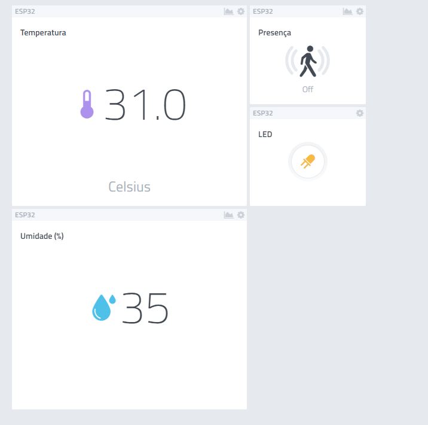

# AV0: Apresentação da plataforma Cayenne

## Cenário

* Foi criado um cenário de execução utilizando um ESP32 conectado à plataforma Cayenne utilizando a API Cayenne MQTT;
* Conectado ao microcontrolador, temos um sensor para monitorar temperatura e umidade e um sensor ultrassônico pra detectar presença no ambiente;
* Temos também um LED que será controlado através da dashboard construída na plataforma;
* Caso seja detectada alguma presença no ambiente, através da plataforma enviamos um aviso por e-mail que uma presença foi detectada no ambiente.

### Configuração para conexão

Deve ser criado um arquivo `config.h` na pasta `src` com as seguintes variáveis:

```cpp
#define __CONFIG_H__
#ifdef __CONFIG_H__

// Informações da rede Wi-Fi
char ssid[] = "";
char wifi_password[] = "";

// Credenciais disponíveis para o dispositivo na plataforma
char username[] = "";
char mqtt_password[] = "";
char client_id[] = "";

#endif
```

## Dashboard


## Referências

* Biblioteca para o sensor ultrassônico: https://github.com/makerhero/Ultrasonic
